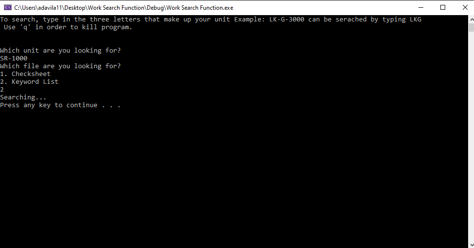

# AD_portfolio info
Welcome to my profile!

Below you will find a list of the content inside this repository.

# Side Scrolling Action
Language: C++/UE4 Blueprints

Here is my example of a sprint and double jump mechanic for a side-scroller in UE4. The foliage and character are free uassests from the UE4 marketplace.

# Work Search Function
Language: C++

Here is a search function I built to help me locate common files that I used on a regular basis and it wasn't possible to bookmark these specific files as there were more than 300 of them. 

When you open the software you are prompted with two menus. You then put the product number into the input and which specific files you're looking for. Once the file is located, it will open your file. 

# EE Calculator
Language: C++

This small command prompt program is a house for all Electrical Engineering and physics formulas. You will be able to calculate everything from Ohm's law to complex nodal analysis on a circuit board.

Menu

What you can currently evaluate.

  * Ohm's Law

The basics of Electrical Engineering, these simple equations can help you analyze just about anything once you understand all component concepts. But having a calculator for it is just plain cool.

  * Capacitor Charge Up

Calculates the amount of energy given to you by calculating voltage, resistance and capacitance of your capacitor.

Still needs work on calculating voltage at a specific time, but when its done you will be able to calculate all voltage times with an array.

# In progress for EE Calc.

Language: C++

**T-Match Impedance Calculations**

**Radio Frequency Power Conversion**

 **Power Density**

# Door Game
Language: C++

This is a fun little game where you have to choose a door, fight enemies and try to get passed 4 doors.

# Angels Course Project
Language: C++

For one of my CS course projects, I started working on an inventory system that allows you to only login if your currently have an account. This reads and writes data, but object oriented area needs work.
