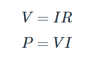
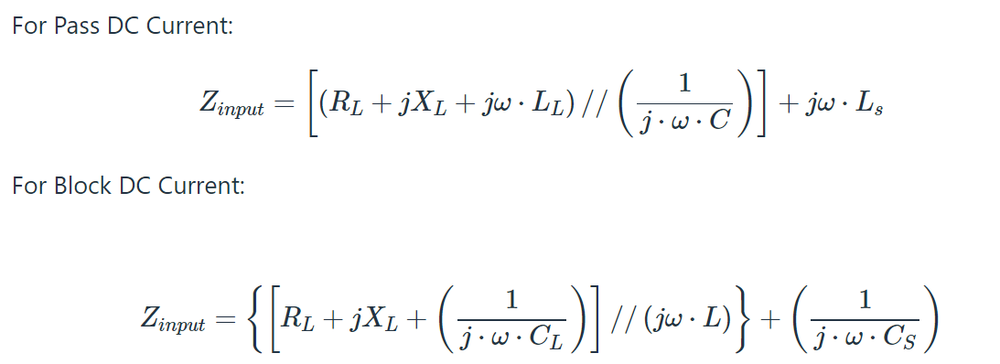
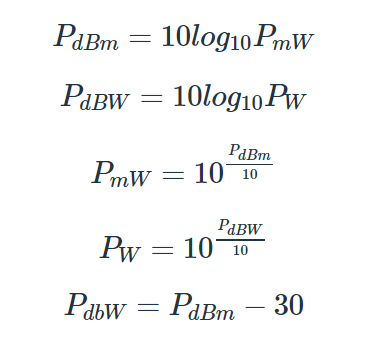

# AD_portfolio info
Below you will find a list of the content inside this repository.

# Side Scrolling Action
Example of sprint/double jump mechanic.

# EE Calculator
This small command prompt program is a house for all Electrical Engineering and physics formulas. You will be able to calculate everything from Ohm's law to complex nodal analysis on a circuit board.

Below is a picture of current menu screen. Currently you can evaluate:

  * Ohm's Law
  

The basics of Electrical Engineering, these simple equations can help you analyze just about anything once you understand all component concepts. But having a calculator for it is just plain cool.

  * Capacitor 
  
  

Still needs work on calculating voltage at a specific time, but when its done you will be able to calculate all voltage times with an array.

# In progress for EE Calc.

**T-Match Impedance Calculations**

**Radio Frequency Power Conversion**

 **Power Density**

# Door Game

This is a fun little game where you have to choose a door, fight enemies and try to get passed 4 doors.

# Angels Course Project
For one of my CS course projects, I started working on an inventory system that allows you to only login if your currently have an account. This reads and writes data, but object oriented area needs work.
